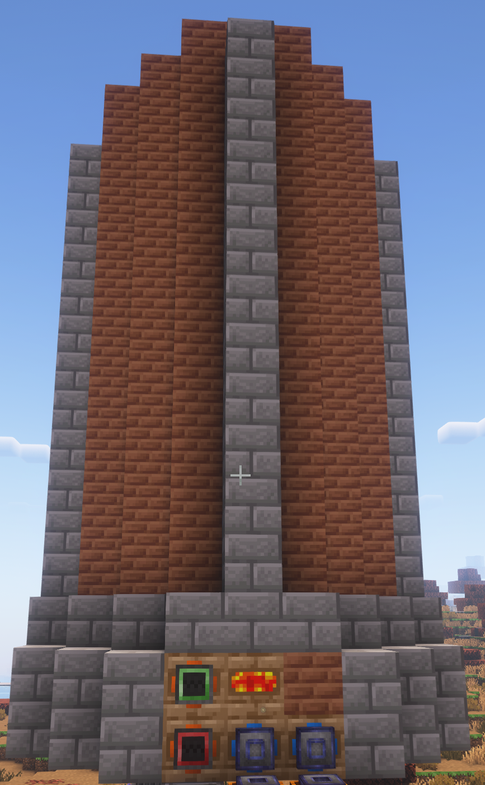
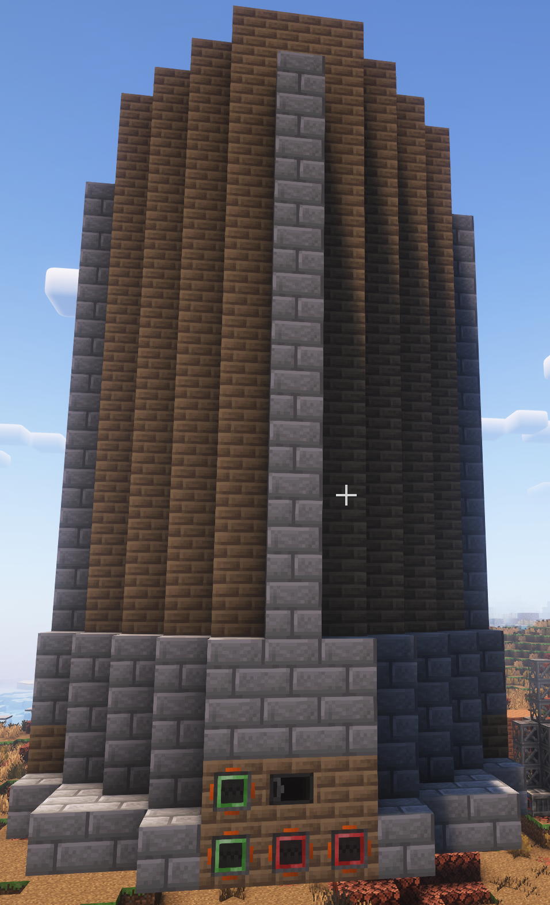

## 关于本模组  
## About This Mod

GTNH私货模组  
A private mod for GTNH

为GTNH添加一些机器、物品，使得前期更轻松一些。  
Adds several machines and items to GTNH to make the early game easier.

## 机器、物品  
## Machines and Items

* ### 大型焦炉  
  ### Large Coke Oven

  不用再堆焦炉阵列了  
  No need to stack arrays of coke ovens anymore.

  搭建4个焦炉所需的焦炉砖即可搭建大型焦炉，提供4并行，加高建筑以提高并行数，最高16并行。  
  You can build a large coke oven with the bricks required for 4 coke ovens, providing 4 parallel processing. Increase the height for more parallelism, up to 16.

  可以使用原始仓室来实现自动化。  
  Primitive hatch can be used for automation.

  

* ### 大型土高炉  
  ### Large Primitive Blast Furnace

  不用再堆土高炉阵列了  
  No need to stack primitive blast furnace arrays anymore.

  搭建4个土高炉所需的材料即可搭建大型土高炉，提供4并行，加高建筑以提高并行数，最高16并行。  
  Build with the materials for 4 primitive blast furnaces, providing 4 parallel processing. Increase the height for up to 16.

  可以使用原始仓室来实现自动化。  
  Primitive hatch can be used for automation.

  

* ### 更便宜的虚空矿机  
  ### Cheaper Void Miner

  参考[更便宜的虚空矿机](https://github.com/Jonodonozym/CheaperVoidMiners)，添加原始版本和蒸汽版本。~~JOJO,我不想再挖矿啦~~  
  Inspired by [CheaperVoidMiners](https://github.com/Jonodonozym/CheaperVoidMiners), adds primitive and steam versions. ~~JOJO, I don't want to mine anymore!~~

  移除了采矿管道的需求(~~感谢原始人提供技术支持。~~)  
  Mining pipes are no longer required (~~thanks to primitive technology support.~~)

  * 原始(木制)：2秒(40t)/次，2个粗矿，需要放入可燃物做为燃料  
    Primitive (wood): 2s (40t)/operation, 2 raw ores, needs burnable fuel

  * 蒸汽：1秒(20t)/次，2个粗矿，需要通入蒸汽作为燃料(20mb/t)  
    Steam: 1s (20t)/operation, 2 raw ores, needs steam (20mb/t) as fuel

  * LV: 0.5秒(10t)/次，1个原矿，32 eu/t  
    LV: 0.5s (10t)/operation, 1 ore, 32 eu/t

  * HV: 0.5秒(10t)/次，2个原矿，512 eu/t  
    HV: 0.5s (10t)/operation, 2 ores, 512 eu/t

  * IV: 0.5秒(10t)/次，4个原矿，8192 eu/t  
    IV: 0.5s (10t)/operation, 4 ores, 8192 eu/t

* ### 原始仓室  
  ### Primitive Hatch

  使用了原始人技术制造出来的仓室。  
  Hatch made with primitive technology.

  * 原始输入总线: 1格，无虚拟电路  
    Primitive input bus: 1 slot, no virtual circuit

  * 原始输出总线: 1格，无自动输出，无过滤  
    Primitive output bus: 1 slot, no auto output, no filtering

  * 原始输入仓: 8B容量（目前似乎没有使用场景）  
    Primitive input hatch: 8B capacity (no current use case)

  * 原始输出仓: 64B容量，无流体锁定功能  
    Primitive output hatch: 64B capacity, no fluid lock

* ### 虚拟油田定位卡  
  ### Virtual Oil Field Locator Card

  在虚拟油田所在区块右键定位卡，会将维度和区块坐标以及所包含的虚拟油田的信息保存至定位卡中。  
  Right-click the locator card in a chunk with a virtual oil field to save the dimension, chunk coordinates, and oil field info.

  在油气矿机的控制器方块物品栏中放入虚拟油田定位卡，油气矿机会直接挖取定位卡上记录的区块内包含的虚拟油田。  
  Place the locator card in the oil miner's controller slot to mine oil directly from the recorded chunk.

* ### 修改多方块矿机  
  ### Modified Multiblock Miners

  现在采集虚拟资源(油气、虚空)的多方块矿机都不需要采矿管道了(~~再次感谢原始人提供技术支持。~~)  
  Multiblock miners for virtual resources (oil, void) no longer need mining pipes (~~thanks again to primitive tech support.~~)

* ### 便携合成站  
  ### Portable Crafting Station

  使用便携合成站,在需要修复匠魂工具时,不需要每次都把合成站放置在地上,直接使用即可。  
  With the portable crafting station, you don't need to place it on the ground to repair Tinkers' tools; just use it directly.

  你还可以绑定快捷键,只要背包里有便携合成站,按下快捷键就能打开合成站界面.  
  You can bind a hotkey, and as long as you have the portable crafting station in your inventory, pressing the hotkey will open the crafting UI.

## TODO List  

* [ ] 完善Tooltips  
  Improve tooltips

* [X] 便携合成站  
  Portable crafting station

* [ ] 蒸汽油气矿机  
  Steam oil miner
